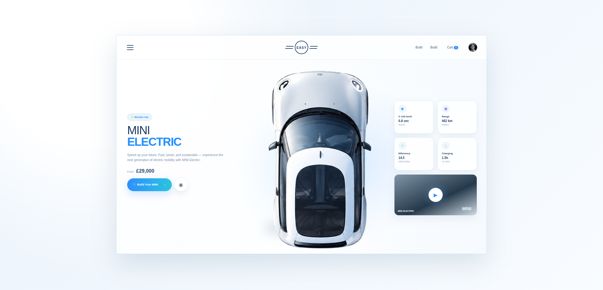

# EASY — MINI Electric White Label Landing Page

A clean white-label recreation of the supplied MINI Electric interface using plain HTML, CSS and JavaScript.

## Features

- Responsive desktop/tablet/mobile layout
- White + pale-blue visual system
- Central electric car hero visual built from CSS shapes
- MINI-style top navigation
- Speed, range, efficiency and charging cards
- Video preview card
- Build Your MINI modal
- Cart counter interaction
- Toast notifications
- No icon-font dependency
- Pure HTML/CSS/JavaScript

## Project structure

```text
easy-mini-electric/
├── index.html
├── style.css
├── script.js
├── README.md
└── assets/
    ├── car.png
    └── reference.png
```

## Run locally

Open `index.html` directly in a browser.

## Deploy to GitHub Pages

1. Upload the folder to a GitHub repository.
2. Go to **Settings → Pages**.
3. Select the repository branch and root folder.
4. Save and open the generated GitHub Pages URL.

## Reference design



## Customization

Update the CSS variables at the top of `style.css` to change the blue/cyan accent colors, card shadows and page background.

## Important

This is a UI recreation for learning and portfolio use. The generated implementation does not use the official MINI logo or proprietary website code.


### Car visual
The hero uses a local `assets/car.png` image instead of the previous CSS/SVG car illustration, giving a more realistic and cleaner result.
